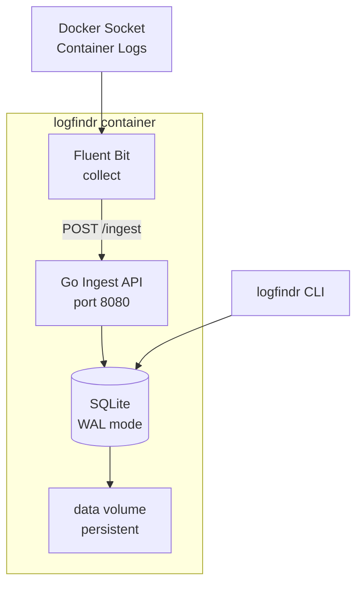

# logfindr

A lightweight, AI-agent-queryable log store for Docker containers. Single container, SQLite-backed, task-indexed, Zstd-compressed.

**logfindr** fills the gap between expensive cloud logging (ELK, Datadog, Loki) and ephemeral `docker logs`. It gives coding agents and developers a persistent, queryable log database that survives container restarts — without the complexity.

## Why logfindr?

Most logging tools are built for cloud scale or real-time viewing. Neither works well for the emerging workflow where **AI coding agents need log context** to debug issues autonomously.

logfindr is designed so an agent can run:

```bash
./logfindr query --task fix-bug-v1 --severity error
```

...and get exactly the logs it needs. No dashboards, no copy-paste, no browser tabs.

### What makes it different

- **Task-based labeling** — tag logs by the task you're working on, compare "broken" vs "stable" runs
- **Agent-first CLI** — every command outputs structured, parseable text
- **Single container** — Go binary + Fluent Bit, nothing else to deploy
- **Persistent** — SQLite in WAL mode on a Docker volume, logs survive restarts
- **Tiny footprint** — targets <20MB RAM
- **Zstd compression** — shrinks log data up to 90% for long-term storage

## Quick Start

### Docker Compose (recommended)

```bash
docker compose up -d
```

This starts logfindr with Fluent Bit collecting logs from all Docker containers on the host.

### Build from source

```bash
go build -o logfindr ./cmd/logfindr/
./logfindr serve --db ./logfindr.db
```

## Architecture



**Fluent Bit** (C) collects logs from Docker containers via the Docker socket and forwards them over HTTP to the **Go binary**, which compresses them with Zstd and stores them in SQLite.

## CLI Reference

### `logfindr serve`

Start the ingest server. Runs inside the Docker container automatically.

```bash
logfindr serve --db /data/logfindr.db --addr :8080
```

### `logfindr tag`

Set the active task ID. All incoming logs without an explicit task ID will be tagged with this.

```bash
logfindr tag --task fix-auth-bug
```

### `logfindr query`

Pull logs with filters.

```bash
# By task
logfindr query --task fix-auth-bug

# By container and time range
logfindr query --container api-server --since 1h

# By severity
logfindr query --severity error --limit 50

# Combine filters
logfindr query --task fix-auth-bug --severity error --since 30m
```

Output:

```
[2026-03-25 20:14:28] api-server | error | task=fix-auth-bug | connection refused to database
[2026-03-25 20:14:28] api-server | warn  | task=fix-auth-bug | retrying connection in 5s

--- 2 log(s) returned ---
```

### `logfindr tasks`

List all task IDs with log counts and time ranges.

```bash
logfindr tasks
```

Output:

```
TASK ID                            LOGS  FIRST SEEN            LAST SEEN
------------------------------------------------------------------------------------
fix-auth-bug                          3  2026-03-25 20:14:28   2026-03-25 20:15:01
stable-v2                             2  2026-03-25 19:00:12   2026-03-25 19:30:45
```

### `logfindr compare`

Compare logs between two tasks side-by-side. Useful for spotting what went wrong in a failing run vs a stable one.

```bash
logfindr compare --task-a fix-auth-bug --task-b stable-v2
```

Output:

```
Task Comparison: fix-auth-bug vs stable-v2
============================================
                     fix-auth-bug  stable-v2
Total logs                      3          2
Errors                          1          0
Warnings                        1          0

--- Errors in fix-auth-bug ---
  [20:14:28] api-server: connection refused to database
```

### `logfindr stats`

Show database size, log counts, and compression efficiency.

```bash
logfindr stats
```

Output:

```
Logfindr Statistics
====================
Total logs:        1284
Total tasks:       7
DB file size:      2.1 MB
Raw log data:      18.4 MB
Stored (Zstd):     2.0 MB
Compression ratio: 9.2x
```

## Ingest API

logfindr exposes a simple HTTP API for log ingestion. Fluent Bit uses this internally, but you can also send logs directly.

### `POST /ingest`

```bash
curl -X POST http://localhost:8080/ingest \
  -H "Content-Type: application/json" \
  -d '{
    "message": "connection timeout after 30s",
    "container_name": "api-server",
    "container_id": "abc123",
    "task_id": "fix-auth-bug",
    "severity": "error",
    "source": "stderr",
    "labels": "{\"env\": \"staging\"}"
  }'
```

All fields except `message` are optional. If `task_id` is omitted, the active task (set via `logfindr tag`) is used.

### `GET /health`

```bash
curl http://localhost:8080/health
# {"status":"healthy"}
```

## Docker Setup

### docker-compose.yml

```yaml
services:
  logfindr:
    build: .
    container_name: logfindr
    ports:
      - "8080:8080"
      - "24224:24224"
    volumes:
      - logfindr-data:/data
      - /var/lib/docker/containers:/var/lib/docker/containers:ro
      - /var/run/docker.sock:/var/run/docker.sock:ro
    restart: unless-stopped

volumes:
  logfindr-data:
```

### Volumes

| Mount | Purpose |
|-------|---------|
| `logfindr-data:/data` | Persistent SQLite database |
| `/var/lib/docker/containers` | Read container log files |
| `/var/run/docker.sock` | Docker socket for container discovery |

### Sending logs via Docker log driver

You can also configure containers to forward logs to logfindr's Fluent Bit forward input (port 24224):

```yaml
services:
  my-app:
    image: my-app:latest
    logging:
      driver: fluentd
      options:
        fluentd-address: localhost:24224
        tag: my-app
```

## Data Model

```go
type LogEntry struct {
    ID            int64
    Timestamp     time.Time
    ContainerID   string
    ContainerName string
    TaskID        string
    Severity      string    // info, warn, error
    Message       []byte    // Zstd compressed
    RawSize       int64     // original byte count
    Labels        string    // JSON key-value pairs
    Source        string    // stdout / stderr
}
```

SQLite schema with indexes on `task_id`, `container_name`, `timestamp`, and `severity` for fast filtered queries.

## Tech Stack

| Component | Role | Why |
|-----------|------|-----|
| Go | Ingest API, CLI, query engine | Fast, single binary, low memory |
| Fluent Bit | Log collection from Docker | C-based, ~5MB RAM, battle-tested |
| SQLite (WAL) | Persistent storage | Zero config, embedded, concurrent reads |
| Zstd | Log compression | Best ratio-to-speed tradeoff |
| Cobra | CLI framework | Standard Go CLI library |

## Project Structure

```
logfindr/
├── cmd/logfindr/
│   ├── main.go          # CLI entrypoint
│   ├── serve.go         # serve command
│   ├── query.go         # query command
│   ├── tasks.go         # tasks command
│   ├── compare.go       # compare command
│   ├── tag.go           # tag command
│   └── stats.go         # stats command
├── internal/
│   ├── compress/        # Zstd wrapper
│   ├── db/              # SQLite layer + schema
│   └── ingest/          # HTTP ingest server
├── configs/fluent-bit/  # Fluent Bit configuration
├── scripts/             # Container entrypoint
├── Dockerfile
├── docker-compose.yml
├── go.mod
└── LICENSE (MIT)
```

## Use Cases

**For coding agents:** Run `logfindr query --task <id>` to pull error context without human intervention. Compare failing vs passing runs with `logfindr compare`.

**For developers:** Keep weeks of local Docker logs searchable without filling your disk. Tag logs by what you're working on so you can find them later.

**For team leads:** Audit any error from weeks ago. Persistent logs on a Docker volume mean nothing vanishes when containers restart.

See [docs/USE_CASES.md](docs/USE_CASES.md) for detailed examples with code snippets covering container logging, AI agent debugging, CI/CD pipelines, regression comparison, and more.

## Roadmap

See [docs/ROADMAP.md](docs/ROADMAP.md) for the full sprint plan and MVP goals.

## License

MIT
